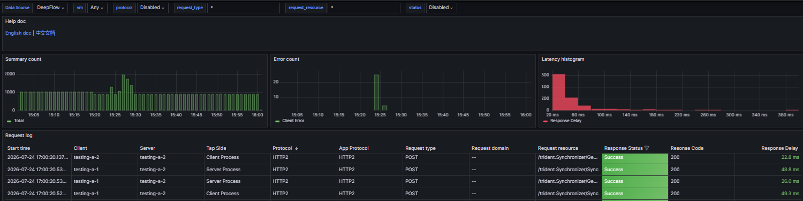
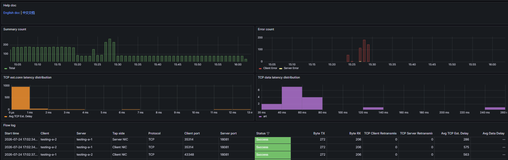
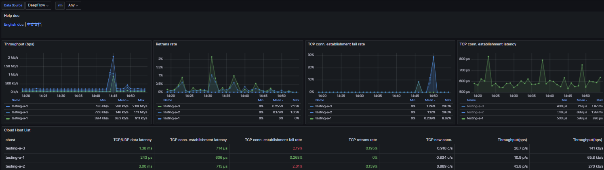
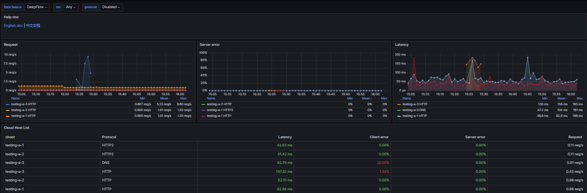

# Orbit critical probing without DeepFlow

This document defines the production probing plan when Orbit/VMLens does not use
DeepFlow. The goal is to keep VM topology useful without creating misleading
traffic, excessive probe load, or unbounded telemetry storage.

## Terms

Do not mix these three TTL concepts.

| Term | Meaning | Example |
| --- | --- | --- |
| Visual TTL | How long the UI animation stays visible after an event | failed request flashes for 4s |
| State timeout | How long before Orbit changes state from connected to degraded/offline | VM disconnected after 3 failed probes |
| Data retention TTL | How long raw/aggregated telemetry is stored | raw flow rows kept 72h |

## Production signal model

```text
VM reachability       Can VM A reach VM B?
Service availability Is service port/protocol alive?
Request activity     Is real user traffic passing now?
Failed attempt       Did traffic/probe fail?
Resource context     Is VM/network/agent healthy enough to trust telemetry?
```

Visual rule:

```text
no reachability        no line
reachability success   green idle line
real request success   green animated line
failed attempt         yellow/red short animation
probe/service failure  degraded state, not counted as user traffic
```

## Orbit dashboard data groups

These four views should exist even when DeepFlow is not used. The difference is
the telemetry source: Orbit uses the VMLens TC/eBPF agent, VM inventory,
synthetic probes, and optional app/proxy instrumentation.

| View | Primary data | Fallback source without DeepFlow | Notes |
| --- | --- | --- | --- |
| Request Log | request attempts, service, status/error, latency, endpoint when available | TC/eBPF L4 attempt + TCP RST + optional app/proxy logs | TC/eBPF alone cannot reliably know HTTP path/status without L7 instrumentation |
| Network Flow | L4 source/destination, ports, protocol, bytes, packets, connections, errors | TC/eBPF on `ens3` | production baseline for topology and traffic accounting |
| Network Cloud | per-VM network health, throughput, retransmission, connection failure, reachability | VM inventory + TC/eBPF aggregates + reachability probes | shows VM network condition, not app correctness |
| Application Cloud | per-service health, request rate, latency, app error state | registered service probes + optional app/proxy metrics | service health should not be inferred only from VM reachability |

### Request Log Live

| Screenshot | File |
| --- | --- |
|  | `docs/screenshot/request-log-live.png` |

| Attribute | Description | Source without DeepFlow | Production note |
| --- | --- | --- | --- |
| `observed_at` | event timestamp | backend ingest time / agent event time | store in UTC |
| `source_vm_id`, `source_name`, `source_ip` | request source VM | VM inventory + IP mapping | must be tenant/project scoped |
| `destination_vm_id`, `destination_name`, `destination_ip` | request destination VM or external target | VM inventory + CIDR classifier | show IP-only node when unmapped |
| `protocol` | TCP/UDP/ICMP or app protocol when known | TC/eBPF, service probe, app/proxy logs | TC/eBPF gives L4; app logs give L7 |
| `service_name`, `service_port` | target service | port classifier + registered service inventory | do not infer too aggressively |
| `request_count` | successful/attempted request count | TC/eBPF connection/request counter | probe traffic must not increment this |
| `error_count` | failed attempts/errors | TCP RST, timeout, protocol probe error | drives yellow/red UI flash |
| `status`, `error_reason` | success/failure reason | service probe or app/proxy logs | TCP-only capture may only know refused/timeout |
| `latency_ms` | request/probe latency | service probe, app/proxy logs | TC/eBPF L4 RTT is not equal to app latency |
| `bytes_sent`, `bytes_received` | traffic volume | TC/eBPF counters | useful but not enough to estimate request cost |

Explanation:

Request Log is the user-facing history of communication attempts. Without
DeepFlow, Orbit should treat TC/eBPF as the L4 baseline and enrich it with
service probes or application/proxy logs when available. If only TC/eBPF exists,
the product can show source, destination, port, protocol, bytes, request attempt,
and failed attempt, but not reliable HTTP path/status.

Source priority:

```text
1. app/proxy/OpenTelemetry logs when available
2. protocol-specific service probe result
3. TC/eBPF L4 attempt, success, TCP RST, timeout
```

### Network Flow Live

| Screenshot | File |
| --- | --- |
|  | `docs/screenshot/network-flow-live.png` |

| Attribute | Description | Source without DeepFlow | Production note |
| --- | --- | --- | --- |
| `observed_at` | flow observation time | agent batch time | store in UTC |
| `src_vm_id`, `dst_vm_id` | mapped VM endpoints | VM inventory + IP mapping | nullable when endpoint is external/unmapped |
| `src_ip`, `dst_ip` | packet/flow IP pair | TC/eBPF packet metadata | NAT/VPN may show translated IP |
| `src_port`, `dst_port` | client and server ports | TC/eBPF packet metadata | server port should be preferred for edge label |
| `protocol` | TCP/UDP/ICMP | TC/eBPF | required for topology edge type |
| `direction` | ingress/egress relative to observer VM | TC/eBPF attach side | normalize before displaying route |
| `bytes_sent`, `bytes_received` | flow traffic | TC/eBPF counters | basis for traffic in/out |
| `packets` | packet count | TC/eBPF counters | useful for many-small-request cases |
| `connection_count` | connection/open attempt count | SYN / connect signal | not the same as HTTP request count |
| `request_count` | approximated request/activity count | connection/request inference | should be enriched by L7 when possible |
| `error_count` | failed flow attempts | TCP RST / timeout-derived events | separate from successful request count |
| `retransmit_count` | TCP retransmission pressure | future TCP retransmit probe/counter | optional P2 signal |
| `interface_name` | capture interface | agent interface discovery | default production target is `ens3` |
| `scope` | internal/external classification | CIDR + VM inventory | must filter by tenant/project |

Explanation:

Network Flow is the primary fallback when DeepFlow is unavailable. It is
accurate for L4 topology, bytes, packets, ports, and connection attempts. It
should drive the graph edges and traffic tables, but it should not pretend to be
full application tracing.

Source priority:

```text
1. TC/eBPF on ens3
2. kprobe fallback only when TC is unavailable
3. app/proxy metrics only as enrichment, not replacement
```

### Network Cloud Live

| Screenshot | File |
| --- | --- |
|  | `docs/screenshot/network-cloud-live.png` |

| Attribute | Description | Source without DeepFlow | Production note |
| --- | --- | --- | --- |
| `vm_id`, `vm_name` | cloud host identity | VM inventory | must be ownership scoped |
| `private_ip`, `public_ip` | VM addresses | agent identity + cloud inventory | public IP may be sensitive |
| `region`, `zone` | placement metadata | cloud inventory | needed for multizone topology |
| `interface_name` | observed NIC | agent interface discovery | usually `ens3` in OpenStack |
| `interface_status` | NIC up/down state | OS interface scan | sample every 60s |
| `throughput_bps` | network throughput | TC/eBPF aggregate | derive from bytes over time |
| `rx_bytes`, `tx_bytes` | received/sent totals | TC/eBPF aggregate | do not include probe/control ports |
| `packet_rate` | packets per second | TC/eBPF aggregate | catches small-request pressure |
| `connection_rate` | connections per second | TC/eBPF aggregate | useful for backend/load impact |
| `connection_failure_rate` | failed connection ratio | TCP RST + timeout signals | should be visible separately from request count |
| `retransmit_rate` | TCP retransmission pressure | TCP retransmit counter when available | optional but important for network quality |
| `probe_rtt_ms` | VM-to-VM reachability latency | reachability probe | not equivalent to app latency |
| `reachability_state` | connected/degraded/disconnected | probe state machine | drives idle graph line |
| `last_seen` | latest VM/agent signal | heartbeat + flow/probe updates | stale/offline based on state timeout |

Explanation:

Network Cloud is the per-VM network health view. It should explain whether a VM
is reachable, how much network traffic it handles, and whether the network is
degraded. It should not be used as proof that an application is healthy.

Source priority:

```text
1. VM inventory and agent heartbeat
2. TC/eBPF flow aggregates
3. reachability probe aggregates
4. OS network interface metadata
```

### Application Cloud Live

| Screenshot | File |
| --- | --- |
|  | `docs/screenshot/application-cloud-live.png` |

| Attribute | Description | Source without DeepFlow | Production note |
| --- | --- | --- | --- |
| `vm_id`, `vm_name` | VM running the service | VM inventory | service belongs to tenant/project |
| `service_name` | application/service label | registered service inventory | avoid guessing from port alone |
| `protocol` | HTTP/gRPC/Redis/Postgres/etc | service registration + probe type | L4 fallback is less precise |
| `port` | service listen port | listener scan / service registry | only probe allowlisted ports |
| `health_state` | healthy/degraded/down | service probe state machine | separate from VM reachability |
| `request_rate` | app request rate | app/proxy logs, L7 metrics, fallback L4 estimate | TC/eBPF estimate is approximate |
| `error_rate` | app/service error ratio | app/proxy logs + service probe failures | TCP RST is only transport error |
| `latency_avg_ms` | average response/probe latency | service probe/app metrics | define source clearly in UI |
| `latency_p95_ms` | tail latency | app/proxy metrics or probe aggregate | P95 needs enough samples |
| `last_status_code` | latest HTTP/gRPC status when known | app/proxy logs or HTTP probe | unavailable for pure TC/eBPF |
| `last_error_reason` | latest failure reason | service probe / app logs / transport failure | useful for debugging |
| `last_success_at` | latest successful service check | service probe | required for recovery logic |
| `last_failure_at` | latest failed service check | service probe | required for degraded/down state |

Explanation:

Application Cloud is service health, not network health. Without DeepFlow, Orbit
needs registered service probes or application/proxy instrumentation to make
this view accurate. TC/eBPF can provide fallback signals, but it cannot reliably
identify HTTP routes, status codes, or application errors by itself.

Source priority:

```text
1. registered service probe
2. app/proxy/OpenTelemetry metrics
3. TC/eBPF L4 signals as fallback only
```

## Production default profile

Use this profile as the default for staging/production.

| Setting | Recommended default | Reason |
| --- | --- | --- |
| Agent heartbeat interval | `10s` | responsive enough without high fleet load |
| Agent stale timeout | `45s` | tolerates short network jitter |
| Agent offline timeout | `5m` | avoids false offline during brief backend/SSH/tunnel issue |
| Reachability probe interval | `15s` | enough for topology connection state |
| Reachability probe timeout | `1s` | fail fast; do not block agent loop |
| Reachability fail threshold | `3 consecutive failures` | disconnected after about 45-60s |
| Reachability recovery threshold | `1 success` | reconnect quickly after service returns |
| Request success visual TTL | `3s` | UI feedback only |
| Failed attempt visual TTL | `4s` | slightly longer so users notice failure |
| Service probe interval | `30s` | service health, not realtime traffic |
| Service probe timeout | `2s` | allows app-level latency without long waits |
| Service unhealthy threshold | `3 consecutive failures` | reduce false alarms |
| Service recovery threshold | `2 consecutive successes` | avoid flapping |
| TC/eBPF batch interval | `1s` | near realtime, bounded backend writes |
| Graph query window | `15m` | enough recent context for topology |
| Internal activity window | `5m` | fast table, low noise |

Large fleet profile:

```text
heartbeat_interval = 30s
agent_stale_timeout = 2m
agent_offline_timeout = 10m
reachability_probe_interval = 30s
reachability_fail_threshold = 3
service_probe_interval = 60s
max_probe_targets_per_vm = 25
```

Realtime lab profile:

```text
heartbeat_interval = 5s
agent_stale_timeout = 20s
agent_offline_timeout = 90s
reachability_probe_interval = 5s
reachability_fail_threshold = 3
service_probe_interval = 10s
```

## Critical probes

| Priority | Signal | Probe source | Interval | State timeout / TTL | Product use |
| --- | --- | --- | --- | --- | --- |
| P0 | Agent health | agent heartbeat to control plane | 10s | stale 45s, offline 5m | VM online/stale/offline |
| P0 | VM identity | hostname, machine-id, private IP, public IP, NIC list | start + heartbeat refresh | last known until VM deleted | map IP to VM node |
| P0 | VM reachability | TCP probe to `vmlens-agent:18081` | 15s | fail after 3 misses | green idle connection line |
| P0 | L4 traffic | TC/eBPF on main NIC, usually `ens3` | 1s batch | graph window 15m | request animation and traffic metrics |
| P0 | Failed TCP attempt | TC/eBPF TCP RST detection | 1s batch | visual 4s, store normally | yellow/red failed edge |
| P0 | Request frequency | TC/eBPF connection/request counter | 1s batch | graph window 15m | request pressure signal |
| P0 | Bytes/packets | TC/eBPF byte + packet counters | 1s batch | graph window 15m | traffic in/out metrics |
| P0 | Internal/external scope | VM inventory + CIDR classifier | every ingest | persistent classification | VM-to-VM vs external |
| P1 | Service availability | TCP connect to registered service ports | 30s | unhealthy after 3 failures | service up/down |
| P1 | HTTP availability | HTTP `GET /health`, fallback `HEAD /` | 30s | unhealthy after 3 failures | HTTP service status |
| P1 | DNS availability | DNS query | 30-60s | unhealthy after 3 failures | DNS dependency health |
| P1 | TLS availability | TCP connect + TLS handshake | 60s | unhealthy after 3 failures | cert/handshake issue |
| P1 | Latency | probe RTT + TCP connect time | per probe | aggregate 15m/1h | connection quality |
| P1 | Error rate | failed probe + RST counter | 1s batch / probe interval | aggregate 15m/1h | failure visibility |
| P1 | Interface status | NIC up/down, IP, route | 60s | unhealthy after 2 samples | bad network config |
| P1 | Resource pressure | CPU, memory, disk, load | 60s | aggregate 1h | explain agent/service issues |
| P2 | Listener inventory | local `ss`/proc listener scan | 60s | last known 5m | discover app ports |
| P2 | Retransmission | TCP retransmit counters if available | 1s batch | aggregate 15m/1h | network quality |
| P2 | Jitter/loss | ICMP/UDP probe | 60s | aggregate 15m/1h | unstable network detection |

## Service-specific probes

Only probe services explicitly registered by the user or discovered from an
allowed service inventory. Do not probe every port.

| Service | Probe | Success condition | Failure signal |
| --- | --- | --- | --- |
| HTTP | `GET /health`, fallback `HEAD /` | expected 2xx/3xx | 4xx/5xx/timeout/refused |
| HTTPS | TCP connect + TLS handshake + HTTP probe | valid TLS + expected status | TLS error/expired cert/timeout |
| gRPC | gRPC health check | `SERVING` | non-serving/timeout/refused |
| Redis | `PING` | `PONG` | auth/refused/timeout |
| PostgreSQL | connect + `SELECT 1` | row returned | auth/refused/timeout/query error |
| MySQL | connect + `SELECT 1` | row returned | auth/refused/timeout/query error |
| RabbitMQ | AMQP connect or management health endpoint | connection ok / health ok | refused/auth/timeout |
| Kafka | metadata request | broker metadata returned | broker unavailable/timeout |
| Kubernetes API | `/readyz` or `/livez` | `ok` | non-ok/timeout/refused |
| DNS | query known domain | expected answer | timeout/unexpected answer |
| NTP | time query | time returned within skew limit | timeout/high skew |

## Edge state machine

```text
UNKNOWN
  no traffic and no probe history

CONNECTED
  latest reachability probe success is inside connection state timeout
  visual: green idle line

ACTIVE
  real traffic/request observed inside request visual TTL
  visual: green animated line on top of connected line

FAILED_ATTEMPT
  TCP RST, timeout, or service probe failure inside failed visual TTL
  visual: yellow/red short animation

DEGRADED
  service probe failed threshold, but VM reachability still works
  visual: keep VM connection, mark service/edge warning

DISCONNECTED
  reachability probe failed threshold or no success inside timeout
  visual: remove line or show grey disconnected state
```

State transitions:

```text
CONNECTED -> DISCONNECTED
  after reachability_fail_threshold consecutive failed probes

DISCONNECTED -> CONNECTED
  after 1 successful reachability probe

SERVICE_HEALTHY -> SERVICE_DEGRADED
  after service_unhealthy_threshold consecutive failed service probes

SERVICE_DEGRADED -> SERVICE_HEALTHY
  after service_recovery_threshold consecutive successful probes
```

## Data retention TTL

Recommended production retention when DeepFlow is not used:

| Data | Retention | Notes |
| --- | --- | --- |
| Raw flow observations | `72h` | enough for recent debugging; can be high volume |
| Per-minute flow aggregates | `30d` | traffic trend and billing-like summaries |
| Per-hour flow aggregates | `180d` | long-term capacity planning |
| Connection probe raw results | `24h` | high frequency; only recent detail needed |
| Connection probe aggregates | `30d` | uptime/reachability history |
| Service probe raw results | `7d` | useful for incident review |
| Service probe aggregates | `90d` | SLO and service health history |
| Agent heartbeat raw/status changes | `30d` | operational audit |
| VM inventory | until VM/project deletion | needed for ownership and topology |
| External IP/domain inventory | `30-90d` | configurable, may contain sensitive data |
| Error events | `30d` | keep longer than raw traffic for incident analysis |

If storage is small, use this minimum:

```text
raw_flow_observations = 24h
minute_aggregates = 14d
hour_aggregates = 90d
probe_raw = 24h
probe_aggregates = 30d
```

## Traffic accounting rules

Probes must not inflate user traffic.

```text
source = orbit_probe | vmlens_probe
counted_as_request = false
counted_as_user_traffic = false
```

Exclude control-plane/probe ports from product traffic metrics:

```text
18080  VMLens backend reverse tunnel
18081  VMLens connectivity probe listener
18082  lab relay/backend bridge
20033  DeepFlow control traffic
20035  DeepFlow control traffic
30033  DeepFlow control traffic
30035  DeepFlow control traffic
```

Keep failed attempts separate:

```text
request_count = successful or attempted app-level traffic count
error_count = TCP RST / timeout / protocol error count
probe_count = Orbit/VMLens synthetic checks
```

For UI:

```text
request_count drives green request animation
error_count drives yellow/red failed animation
probe_count drives connected/disconnected state only
```

## Probe target selection

Production must avoid automatic all-to-all probing.

Use this order:

```text
1. observe real traffic first
2. create/refresh edge from real traffic
3. keep only known edges alive with reachability probes
4. service-probe only registered or allowlisted service ports
5. expire edges after state timeout if no successful reachability probe
```

Recommended limits:

```text
max_probe_targets_per_vm = 50
max_probe_rps_per_vm = 5
probe_timeout = 1s for reachability, 2s for service
failed_after = 3 consecutive failures
jitter = random 0-20% per interval
```

Large fleet limits:

```text
max_probe_targets_per_vm = 25
max_probe_rps_per_vm = 2
service_probe_interval = 60s
```

## Minimal data model

### VM inventory

```text
vm_id
tenant_id
project_id
region
zone
name
hostname
machine_id
private_ip
public_ip
interfaces
default_route
status
last_seen
```

### Agent health

```text
agent_id
vm_id
agent_version
capture_mode
capture_interface
status
last_heartbeat_at
last_error
```

### Reachability probe

```text
src_vm_id
dst_vm_id
src_ip
dst_ip
protocol
dst_port
success
rtt_ms
error_reason
consecutive_failures
observed_at
counted_as_user_traffic=false
```

### Service probe

```text
src_vm_id
dst_vm_id
service_name
protocol
host
port
path
success
status_code
latency_ms
error_reason
consecutive_failures
observed_at
counted_as_user_traffic=false
```

### L4 flow from TC/eBPF

```text
src_vm_id
dst_vm_id
src_ip
dst_ip
src_port
dst_port
protocol
direction
bytes_sent
bytes_received
packets
connection_count
request_count
error_count
retransmit_count
first_seen
last_seen
observed_at
```

## Production enablement plan

Phase 1:

```text
agent heartbeat
VM identity inventory
TC/eBPF L4 capture on ens3
TCP RST failed-attempt detection
VMLens reachability probe on 18081
internal/external classifier
raw + aggregate retention policy
```

Phase 2:

```text
registered service probe
HTTP/gRPC/Redis/Postgres/etc protocol-specific probe
service health state
latency/error aggregates
```

Phase 3:

```text
resource pressure correlation
retransmission/jitter/loss metrics
SLO dashboards
tenant-level retention overrides
```

## Essentials

Minimum production-critical data:

```text
VM inventory
agent heartbeat
TCP reachability probe
TC/eBPF bytes/packets/connections
TCP RST failed attempts
request_count
error_count
internal/external classification
last_seen timestamps
retention TTL policy
tenant/project ownership boundary
```
